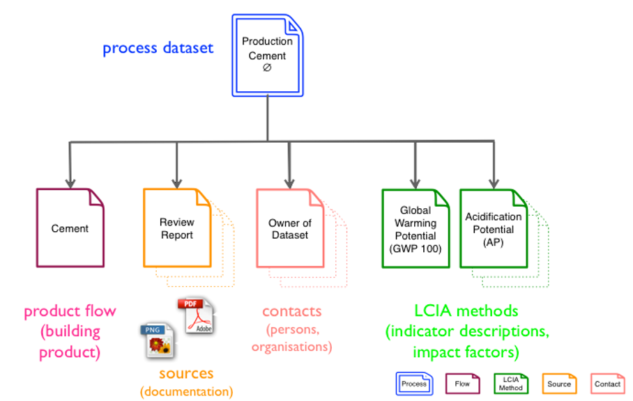
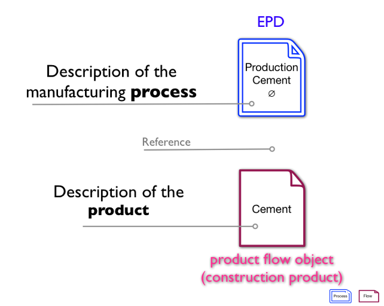
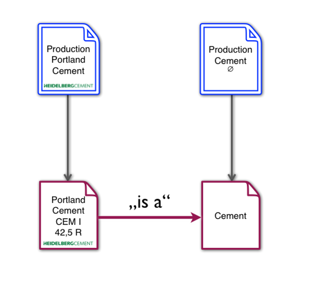

# EPD Data Format – Developer Quick Start Guide

## About this document

This document serves as a starting point for software developers who want to integrate support for the ÖKOBAUDAT’s EPD data format and/or data exchange to or from the ÖKOBAUDAT into their software applications.

## Data Format – General Information

The data format used to describe EPDs in the ÖKOBAUDAT database is based on the European Commission’s ILCD Format (see  the information provided at http://eplca.jrc.ec.europa.eu/LCDN/developer.xhtml).

 

Figure 1 - ILCD format data set types

Information that cannot be modelled using the ILCD Format’s native constructs is documented using extensions in the EPD namespace (*http://www.iai.kit.edu/EPD/2013* namespace URI). These additional fields are documented in detail in the *EPD_DataSet.html* and *EPD_FlowDataSet.html* documents in the *doc/schemadoc/* folder of the documentation package, where they are highlighted in a different color for better identification.

Figure 2 - Extending the ILCD data format

Sample documents which illustrate the various use cases are provided in the folder *sample_data*, as well as XSL stylesheets that can be used to view datasets in HTML representation directly in the browser. The underlying XML Schema documents are also provided in the folder *schemas*.

## Data Format – Concepts

For describing an EPD, the ILCD format’s „Process“ dataset is used. This holds the relevant metadat as well as the inventory results (in the *exchanges* section) and the impact assessment results (in the *LCIAResults* section) for all lifecycle stages of the product.

The actual product is described as a „Flow“ dataset (of type „Product flow“) that is attached to the process as its reference flow. Hence, properties of the actual product, like material properties such as density etc., can be included there. For physical and chemical product properties, the MatML language (http://www.matml.org/) can be used. See the example datasets for how to do this.

Figure 3 - Decoupling of product information

Furthermore, the decoupling of product information allows for modelling hierarchies of products where a number of actual, vendor specific products may represent the same generic product. This relationship is expressed by a reference documented in the „*is A*“-field in a product flow.

Figure 4 - "is a"-references

## Data Exchange via RESTful Service Interface

If the free and open source soda4LCA (http://www.iai.kit.edu/soda4LCA/) software is used as technical platform to distribute data, datasets can be retrieved from or submitted to the database directly from other applications via the software’s RESTful service interface. The API documentation is provided in the folder *doc* in HTML and PDF format.

For reading data from the database, no authentication is required. Authentication credentials required for sumbission of datasets can be obtained from the operator of the respective node.