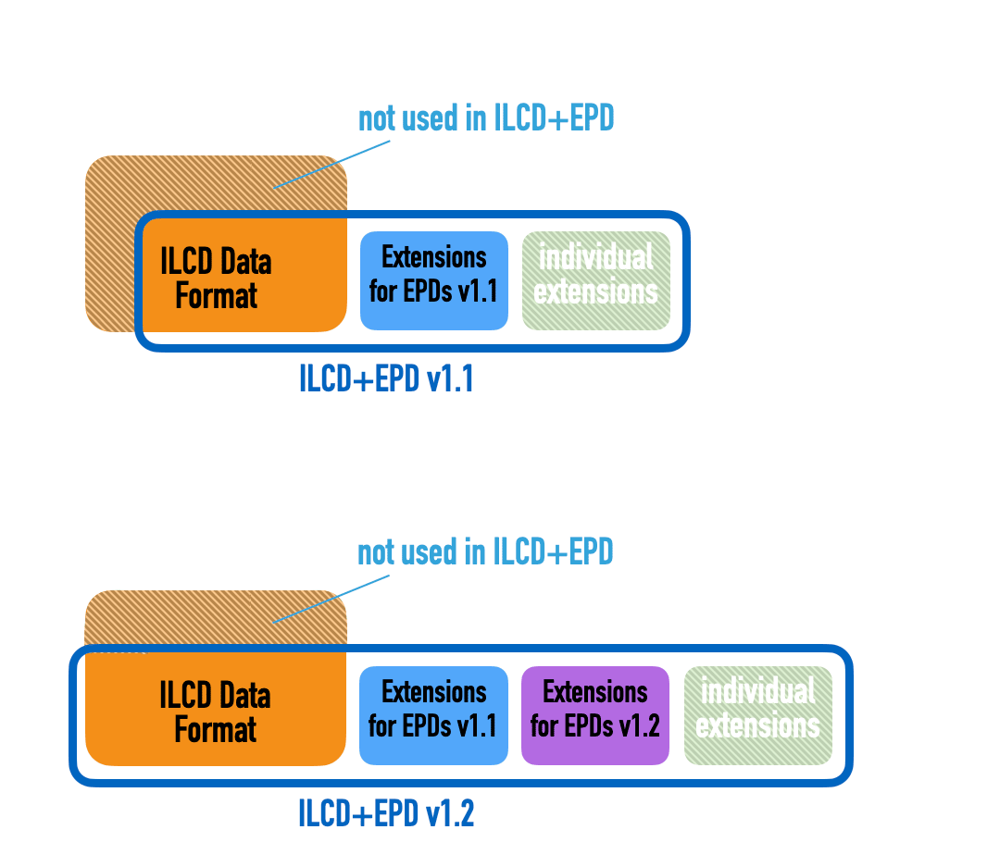

*document version 1.1*

# Migration Guide for ILCD+EPD data format from version 1.1 to 1.2

## Introduction

The v1.2 revision of the ILCD+EPD format specification adds a few more metadata fields  that have been deemed useful during the last few years compared to the initial v1.1 specification. This guide aims at summarizing the changes to the specification. 

## EN15804+A2

Note that the format revision is independent of the new revision of the EN15804 standard, EN15804+A2. EN15804+A2 compliant datasets can also be generated using version 1.1 of the format specification, and EN15804+A1 compliant datasets can be generated using the new version 1.2 of the format specification.

## Namespaces

What is usually referred to as ILCD+EPD data format is more precisely the ILCD data format with extensions for EPDs. These extensions have been added in an extra namespace. There is a number of items present in the original ILCD format which are not being used in ILCD+EPD v1.1 (see figure below).

For the new v1.2 revision, yet some more information items are being added in a new namespace. ***Please note that at the same time, some of the items from the original ILCD format, which were not used previously, have now been added to the ILCD+EPD v1.2 specification.***

### Namespace URIs

The namespace URIs for the original ILCD format are

​	`http://lca.jrc.it/ILCD/Common`

​	`http://lca.jrc.it/ILCD/Process`

​	`http://lca.jrc.it/ILCD/Flow` 

​	etc.

The namespace URI for the EPD extensions from the v1.1 of the specification is `http://www.iai.kit.edu/EPD/2013` .

The namespace URI for the new items introduced with v1.2 of the EPD extensions is `http://www.indata.network/EPD/2019` .

### Format version

To indicate a dataset is conforming to the v1.2 format specification, the *EPD format version* field (*@epd-version* attribute on the root element of a process dataset) is used with the value "1.2".

## Changes in v1.2

This section summarizes the changes to the schemas. See the schema documentation for all the details. 

### New fields in v1.2

A number of new metadata fields has been added:

- *EPD format version* - internal field bearing the value "1.2" for identifying this dataset adheres to the 1.2 format version 
- *Content Declaration*
- *Publication date of EPD*
- *Documentation of data quality management*
- *reference to Original EPD* - this references the source dataset representing the EPD and replaces the reference previously given under *Data source(s) used for this data set*
- *Commissioner of data set*
- *Project*
- *Intended applications*
- *Data set generator / modeller* - replaces *Data entry by*
- *Preceding data set version*
- *Issuer*
- *Registration number*
- *License type*
- *Access and use restrictions*
- *publisher of the data set*

### Removed fields in v1.2

- *Data entry by* has been removed and replaced by *Data set generator / modeller*

## Reference data

The reference data can be obtained from the REFERENCE_DATA data stock on the InData node available at
https://data.indata.network/resource/datastocks/67a67abd-13b6-4a26-a166-5be16cd8feda (REST API)

https://data.indata.network/resource/datastocks/67a67abd-13b6-4a26-a166-5be16cd8feda/export (download as ZIP archive)