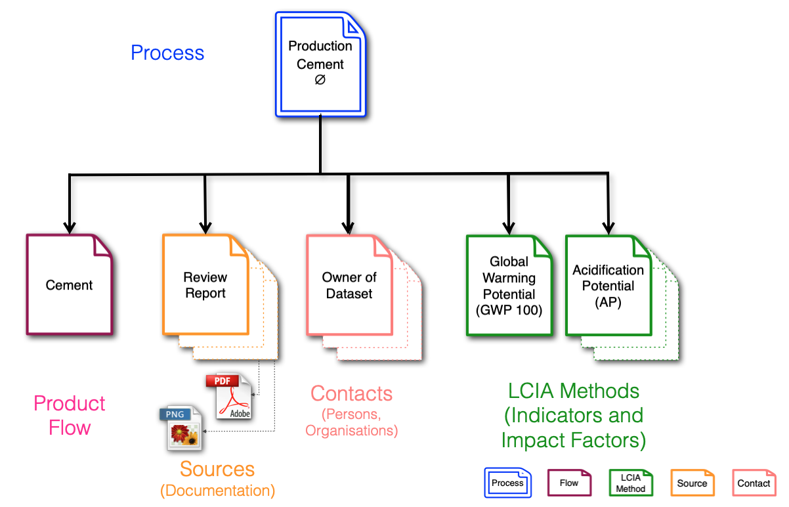
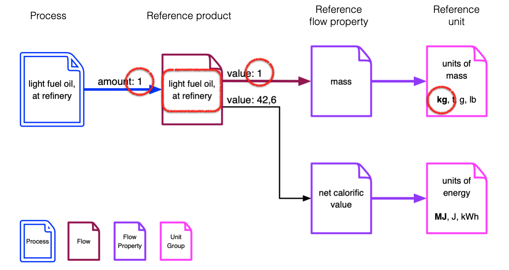
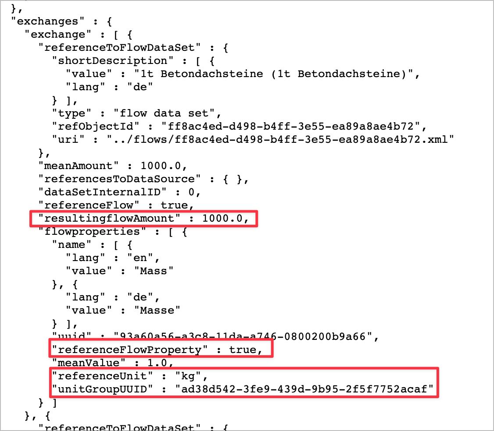

# ILCD+EPD Data Format Introduction


### Object oriented design

The data format used to describe EPDs is based on the European Commission’s extensible ILCD Format (see https://eplca.jrc.ec.europa.eu/LCDN/developer.xhtml), which is complemented by format extensions specific for EPD data (EPD extensions). Hence, the data format for digital EPD data is often referred to as ILCD+EPD.


The ILCD format is based on an object-oriented approach. There are seven data set types: 

•	Process for modelling both unit and aggregated processes for traditional LCA data and for modelling an EPD in ILCD+EPD. Input and output flows are modelled by references to data sets of type Flow. May optionally contain results of an impact assessment, in this case data sets of type LCIA Method will be referenced.

•	Flow describes an elementary, product or waste flow. It references one or more Flow Property data sets. In ILCD+EPD, it is used to model the reference product.

•	Flow Property (quantity) describes physical or other properties of a flow that can be used to quantify it, for example mass or gross calorific value.

•	Unit Group (dimension) describes a group of convertible units and the conversion factors to its reference unit.

•	LCIA Method describes an LCIA method and its characterisation factors e.g.an impact category like global warming potential or ecotoxicity. The data set can also document an entire methodology. The data set references one Flow Property data set, that identifies the quantity of the characterisation factors and thereby their dimension.

•	Source represents an external source of information, such as literature or a database or data format. It can contain a reference to an external binary file (such as a PDF document or PNG image) or resource as well. It can reference a contact it is related to.

•	Contact describes a person or organisation. It can itself again reference another contact, allowing to document hierarchical relationships (e.g. person working group organisation).

The latest version of the full specification of the ILCD+EPD format can be obtained at https://www.indata.network/resources under the "Technical Documents" section. A slide deck with an introduction on the ILCD+EPD format with annotations, which may be helpful as well, can be found [here](https://cloud.okworx.com/index.php/s/7wzdMndTosJDSkb).





### Identification

Each dataset carries a Universally Unique Identifier (UUID) and a version number that is incremented upon changes to the dataset. After every change to the dataset, the version number is incremented, so that the newest dataset always carries the highest version number. As soon as the **meaning** (semantics) of a dataset changes (e.g. a new EPD with a new reference year), a new dataset with a new UUID will be created. 


### References 

Among each other, datasets are linked by references. Referenced data sets are identified by their UUID (and optionally version number).

*** Please note that objects are never referenced by their name, but rather by their UUID (and optionally version number).*** A list of relevant commonly used UUIDs is included in the developer package along with the specification under the link mentioned above.


### Reference product / declared unit

For each EPD, there is a tupel of one process dataset and one flow dataset (of type "product flow", hence we call it the product flow dataset). If the EPDs is for multiple distinct products, usually there should be one EPD dataset for each product (which each will also have a distinct flow dataset).

The product flow dataset contains the information about the declared unit. Here is how it can be identified:

In the process dataset, `/processDataSet/processInformation/quantitativeReference/referenceToReferenceFlow` indicates a number:

```xml
     <quantitativeReference type="Reference flow(s)">
       <referenceToReferenceFlow>42</referenceToReferenceFlow>
     </quantitativeReference>
```


This number matches the contents of the  `@dataSetInternalID` attribute of one `exchange` element in the `exchanges` section: 

```xml
    <exchanges>
        <exchange dataSetInternalID="42">
            <referenceToFlowDataSet type="flow data set" refObjectId="a7432abd-0881-4977-a817-f8aaf627fb91" version="00.00.001">
                <common:shortDescription xml:lang="en">wood panel</common:shortDescription>
            </referenceToFlowDataSet>
            <meanAmount>1.0</meanAmount>
```

The `referenceToFlowDataSet` element points to the product flow dataset which can be retrieved using the `/flows` endpoint of the API, in this example with 

`GET https://<the hostname>/resource/flows/a7432abd-0881-4977-a817-f8aaf627fb91?version="00.00.001"&format=xml  `

In that product flow dataset, there's a section `flowProperties` which contains a reference flow property (whose `@dataSetInternalID` matches the value of `f:quantitativeReference/f:referenceToReferenceFlowProperty`), which is the unit part of the declared unit. 

The numeric part of the declared unit is the product of the `meanAmount` on the reference exchange in the process dataset above and the `meanValue` of the reference flow property in the product flow dataset as shown in the diagram below. 

```xml
...
      <f:quantitativeReference>
         <f:referenceToReferenceFlowProperty>0</f:referenceToReferenceFlowProperty>
      </f:quantitativeReference>
...
   <f:flowProperties>
      <f:flowProperty dataSetInternalID="0">
         <f:referenceToFlowPropertyDataSet type="flow property data set" refObjectId="93a60a56-a3c8-11da-a746-0800200b9a66" version="03.00.000">
            <common:shortDescription xml:lang="en">Mass</common:shortDescription>
         </f:referenceToFlowPropertyDataSet>
         <f:meanValue>1.0</f:meanValue>
      </f:flowProperty>
      <f:flowProperty dataSetInternalID="2">
         <f:referenceToFlowPropertyDataSet type="flow property data set" refObjectId="62e503ce-544a-4599-b2ad-bcea15a7bf20" version="03.03.000">
            <common:shortDescription xml:lang="en">Carbon content (biogenic)</common:shortDescription>
         </f:referenceToFlowPropertyDataSet>
         <f:meanValue>0.96</f:meanValue>
      </f:flowProperty>
      <f:flowProperty dataSetInternalID="3">
         <f:referenceToFlowPropertyDataSet type="flow property data set" refObjectId="262a541b-209e-44cc-a426-33bce30de7b1" version="00.01.000">
            <common:shortDescription xml:lang="en">Carbon content (biogenic) - packaging</common:shortDescription>
         </f:referenceToFlowPropertyDataSet>
         <f:meanValue>0.042</f:meanValue>
      </f:flowProperty>
   </f:flowProperties>
</f:flowDataSet>

```





If using the **extended view** in **JSON** format, this operation is not necessary, as there will be a dedicated `resultingFlowAmount` property which holds the correct resulting value. In the example below, the declared unit is 1000 kg (=1 metric ton).




### Material properties

In the product flow dataset, material properties such as density may be declared using embedded MatML (http://www.matml.org/) markup in order to be able to convert 

Example:

```xml
<MatML_Doc>
    <Material>
        <BulkDetails>
            <Name>(name of the material)</Name>
            <PropertyData property="pr2">
                <Data format="float">138.696</Data>
            </PropertyData>
        </BulkDetails>
    </Material>
    <Metadata>
        <PropertyDetails id="pr2">
            <Name>gross density</Name>
            <Units name="kg/m^3" description="kilograms per cubic metre">
                <Unit>
                    <Name>kg</Name>
                </Unit>
                <Unit power="-3">
                    <Name>m</Name>
                </Unit>
            </Units>
        </PropertyDetails>
    </Metadata>
</MatML_Doc>
```

The property identifier is given under `PropertyDetails/Name/text()` and the value under `PropertyData/Data/text()`.


The following material properties are currently supported:

| **property identifier**     | **unit** | **description**            |
| --------------------------- | -------- | -------------------------- |
| *bulk density*              | kg/m^3   | kilograms per cubic metre  |
| *grammage*                  | kg/m^2   | kilograms per square metre |
| *gross density*             | kg/m^3   | kilograms per cubic metre  |
| *layer thickness*           | m        | metres                     |
| *productiveness*            | m^2      | square metres              |
| *linear density*            | kg/m     | kilograms per metre        |
| *conversion factor to 1 kg* |          |                            |


### Modules

The following modules according to EN 15804 are supported:

A1
A2
A3
A1-A3
A4
A5
B1
B2
B3
B4
B5
B6
B7
C1
C2
C3
C4
D

These values are binding for use in the `@module` attribute.


### EPD results

#### LCI indicators

The results for the various LCI indicators are given in the `exchanges` section, with one `exchange` for each LCI indicator (except for the reference flow, see above). Each indicator is declared using a distinct UUID, a list of which can be found in the format documentation. **Please note that like all other objects, indicators are never referenced by their name, but rather by their UUID (and optionally version number) .**


#### LCIA indicators

The results for the LCIA indicators are given on `LCIAResult` elements in the `LCIAResults` section. The UUIDs for the indicators are likewise listed in the format documentation. 


## API documentation

The ECO Portal and the data providers' nodes are operating on the Open Source [soda4LCA](https://bitbucket.org/okusche/soda4lca/) (*Service Oriented Database Application for LCA data*) platform. A detailed documentation of the REST API is available here:

https://bitbucket.org/okusche/soda4lca/src/7.x-branch/Doc/src/Service_API/Service_API.md


## Authentication
To access the online interface of the ECO Portal as well as of the individual nodes, a so-called access token is required. The same token can be used for accessing both the ECO Portal and for each of the individual nodes.

For authentication, the token is sent with **each request** as an `Authorization` header (Bearer Token).

Example: 

`Authorization: Bearer eyJhb...`

`GET https://data.eco-platform.org/resource/...`

If you don't send the token, you receive get an HTTP `403 Forbidden` return code.

For the examples given in this document, it is assumed that you send the proper token with each request.


## Working with the soda4LCA API

For querying a node that is running soda4LCA and contains ILCD+EPD data,  the ECO Portal, the request will usually look like this:

`GET https://data.eco-platform.org/resource/processes?search=true&distributed=true&virtual=true&metaDataOnly=false&validUntil=2022`

which means that it will return a (paginated) list of all full datasets across the network that are valid at least until 2022. The *metaDataOnly* parameter with the value *false* means that only full datasets will be shown (and dataset stubs, which merely link the PDF, are omitted).

The page size and position can be controlled with the `GET` parameters `pageSize` and `startIndex`. By default, the return format will be XML, if you prefer JSON, add a `format=JSON` `GET` parameter.

`GET https://data.eco-platform.org/resource/processes?search=true&distributed=true&virtual=true&metaDataOnly=false&validUntil=2022&name=plaster%20board`

will return a result set with all datasets that are valid at least until 2022 and contain both of the two words "plaster" and "board".

**See a list of supported query parameters [here](https://bitbucket.org/okusche/soda4lca/src/6.x-branch/Doc/src/Service_API/Service_API_Datasets_Process_Query.md).**


Each result will contain a link to the full dataset in the `xlink:href` attribute of the `process` element, for example

```xml
<p:process p2:metaDataOnly="false" sapi:sourceId="EPD-NORWAY_DIGI" xlink:href="https://epdnorway.lca-data.com/resource/datastocks/91413340-7bf0-4f88-a952-0f91cba685df/processes/165f8554-00cd-43ad-aeb7-ba769854554a?version=00.01.000">
        <sapi:uuid>165f8554-00cd-43ad-aeb7-ba769854554a</sapi:uuid>
```

If you follow this link, you will receive a human-readable HTML representation of the dataset.

If you add an extra parameter `format=xml` to the link, you will receive the full dataset in XML format:

`GET https://epdnorway.lca-data.com/resource/datastocks/91413340-7bf0-4f88-a952-0f91cba685df/processes/165f8554-00cd-43ad-aeb7-ba769854554a?version=00.01.000&format=xml`

If you add an extra parameters `format=json` and `view=extended`  instead, you will receive the full dataset in JSON representation, where relevant information from external references has already been resolved and is rendered inline:

`GET https://epdnorway.lca-data.com/resource/datastocks/91413340-7bf0-4f88-a952-0f91cba685df/processes/165f8554-00cd-43ad-aeb7-ba769854554a?version=00.01.000&format=json&view=extended`

See the section "Extended view" below for details. 


### Base URL

The base URL for each node is of the format

`https://hostname.tld/resource/`

Note the `/resource/` path suffix.


### Querying datasets from a specific node

Thus, with the request

`GET https://ibudata.lca-data.com/resource/processes`

for example, a (paginated) list of all datasets can be retrieved. 
The page size and position can be controlled with the `GET` parameters `pageSize` and `startIndex`.

In this list the single datasets are already linked, the link is in the `xlink:href` attribute of the `process` elements.

A single record is obtained by specifying the UUID (and optionally version number as parameter) of the desired dataset:
`GET https://ibudata.lca-data.com/resource/processes`

`GET https://ibudata.lca-data.com/resource/processes/6017a6ce-1d4e-4e59-b508-294bd9f5f93e`

or

`GET https://ibudata.lca-data.com/resource/processes/6017a6ce-1d4e-4e59-b508-294bd9f5f93e?version=00.01.000`

If no version number is specified, the most recent dataset (with the highest version number) is always returned. 


To query for an EPD number, use the registrationNumber parameter:
`GET https://epdnorway.lca-data.com/resource/datastocks/91413340-7bf0-4f88-a952-0f91cba685df/processes?search=true&registrationNumber=NEPD-1469-488-EN`

To get a list of all contacts (persons and organizations):

`GET https://epdnorway.lca-data.com/resource/datastocks/91413340-7bf0-4f88-a952-0f91cba685df/contacts`

To get the PDF document for an EPD, you can use this syntax:

`GET https://epdnorway.lca-data.com/resource/processes/%3Cuuid%3E/epd?version=<version number>`


e.g.

`GET https://epdnorway.lca-data.com/resource/processes/a31d2258-beaf-4ca3-a163-d0477e9a350f/epd?version=00.00.012`


### Data stocks

A detailed explanation of the concept of data stocks can be found in https://bitbucket.org/okusche/soda4lca/src/7.x-branch/Doc/src/Administration_Guide/Administration_Guide.md in the section "Organizing Data".

A list of all data stocks can be retrieved using  

`GET https://ibudata.lca-data.com/resource/datastocks`


In general, the currently published datasets in the data stock "PUBLIC" will be of interest, these can be obtained using

`GET https://ibudata.lca-data.com/resource/datastocks/7f92c48a-07c6-4a0c-91fd-4166e6138402/processes`


### Return format

The return format can be controlled with the `GET` parameter `format`. The default return format is XML. To get JSON for list views or full datasets, the parameter `format=JSON` can be passed. Full datasets are now also available in JSON representation.

#### Extended view

In both XML and JSON representation, a so-called extended view is available for the process dataset type which will render all relevant information that is represented by external secondary datasets (such as flow, flow properties, units) inline so only one request has to be made to retrieve all information. Examples:

`GET https://epdnorway.lca-data.com/resource/processes/a31d2258-beaf-4ca3-a163-d0477e9a350f?version=00.00.012&format=JSON&view=extended`
`GET https://epdnorway.lca-data.com/resource/processes/a31d2258-beaf-4ca3-a163-d0477e9a350f?version=00.00.012&format=XML&view=extended`


### CSV export

To export a complete data stock as CSV, the following call can be used:

GET https://ibudata.lca-data.com/resource/datastocks/7f92c48a-07c6-4a0c-91fd-4166e6138402/exportCSV

The result will contain one module per row.

If you prefer the decimal separator to be a comma, add an extra GET parameter `decimalSeparator=comma`:

GET https://ibudata.lca-data.com/resource/datastocks/7f92c48a-07c6-4a0c-91fd-4166e6138402/exportCSV?decimalSeparator=comma


**Note: The CSV export feature needs to be enabled explicitly on each node by the Program Operator which may not be the case for all of them.**


