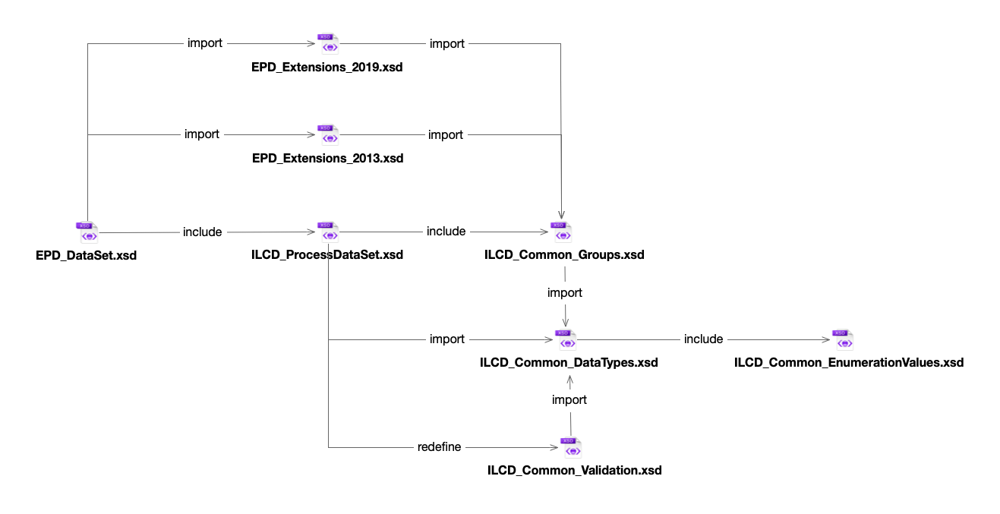

## Schema structure


The top-level XML Schema documents (relevant e.g. for generating classes) are the following:

```
EPD_DataSet.xsd
ILCD_ContactDataSet.xsd
ILCD_FlowDataSet.xsd
ILCD_FlowPropertyDataSet.xsd
ILCD_LCIAMethodDataSet.xsd
ILCD_SourceDataSet.xsd
ILCD_UnitGroupDataSet.xsd
```

The inclusion/import relationships between the schemas are given in this figure:


